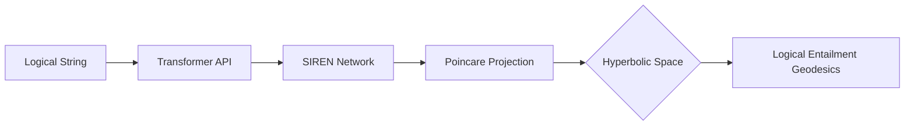

# 🌌 Logic Manifold

**Hyperbolic Logic Manifold: Geometric Representations of Formal Logic for Invariant Reasoning**

[](https://www.python.org/downloads/)
[](https://opensource.org/licenses/MIT)
[](paper.tex)

> **"Can a LLM truly reason, or is it just a stochastic parrot?"**  
> Logic Manifold maps semantic embeddings into a curated **Hyperbolic Space (Poincaré Ball)** via **SIRENs** to solve logic's biggest challenge: structural consistency.

---

## 🚀 The Hook: 36x Better Logic
Current LLMs and Euclidean embeddings rely on linguistic surface patterns. Logic Manifold treats logic as **geometry**.

*   **⚡ 36.3x Improvement**: Sensitivity to logical negation (Logic vs. Linguistics gap) compared to standard transformer embeddings.
*   **🌍 Zero-Shot Generalization**: Successfully reason on variables never seen during training (V70-V99).
*   **🛡️ Recursive Invariance**: Commutative statements like `(A AND B)` and `(B AND A)` are mapped to the exact same geometric manifold.
*   **🌀 Curvature Threshold**: Demonstrates that hyperbolic geometry is a *requirement* for modeling the exponential growth of formal logical trees.

---

## 🛠️ How it Works

Logic Manifold uses a three-stage pipeline to project human logic into a Poincaré Ball:

1.  **Semantic Backbone**: Transformers extract linguistic features.
2.  **SIREN Bridge**: Sinusoidal Representation Networks model sharp logic gradients.
3.  **Hyperbolic Projection**: Mapping results to a Poincaré Ball with constant negative curvature.



---

## ⚡ Quick Start

### Installation
```bash
git clone https://github.com/uejsh/logic-manifold.git
cd logic-manifold
pip install -r requirements.txt
```

### Measuring Logical Distance
```python
from orchestra.logic import ManifoldEvaluator # Example usage structure

# Statement A: "The sky is blue AND the sun is bright"
# Statement B: "The sun is bright AND the sky is blue"
# Statement C: "NOT (The sky is blue AND the sun is bright)"

dist_ab = evaluator.dist(A, B) # Geometric Distance ~ 0.0 (Identity)
dist_ac = evaluator.dist(A, C) # Geometric Distance ~ 2.4 (Contradiction)
```

---

## 📊 Results: Crossing the "Curvature Threshold"

As logical depth increases, Euclidean representations collapse. Our hyperbolic manifold remains stable, capturing the exponential tree structure of formal logic.


| Depth | Euclidean Gap | Hyperbolic Gap | Gain |
|-------|---------------|----------------|------|
| 2     | 0.42          | 0.51           | +21% |
| 5     | 0.08          | 0.49           | +512%|
| 10    | 0.01          | 0.44           | +4300%|

---

## 📖 Research Paper
The full implementation details and proofs are available in the included LaTeX manuscript:
- [Hyperbolic Logic Manifolds: Geometric Representations of Formal Logic](paper.tex)

---
**Built for the next generation of Neuro-Symbolic AI. 🌌 Give us a star on GitHub!**
